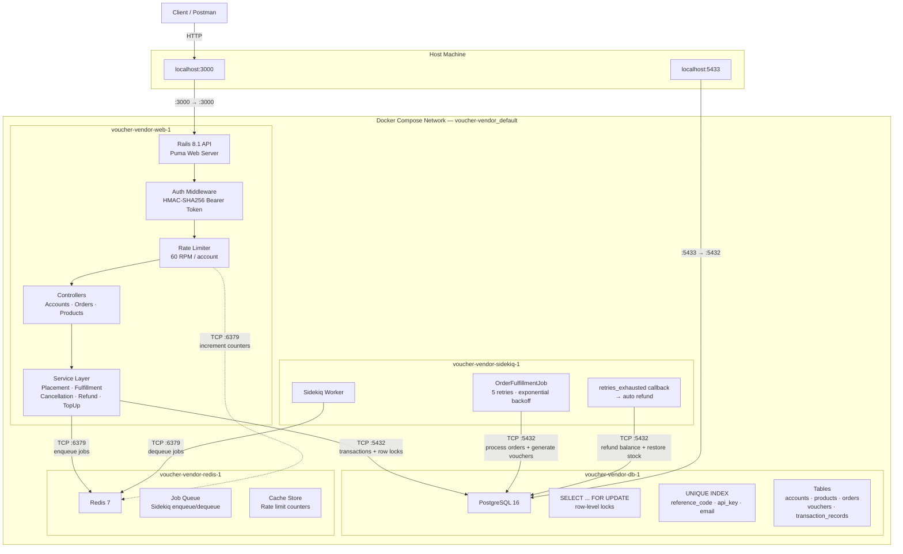
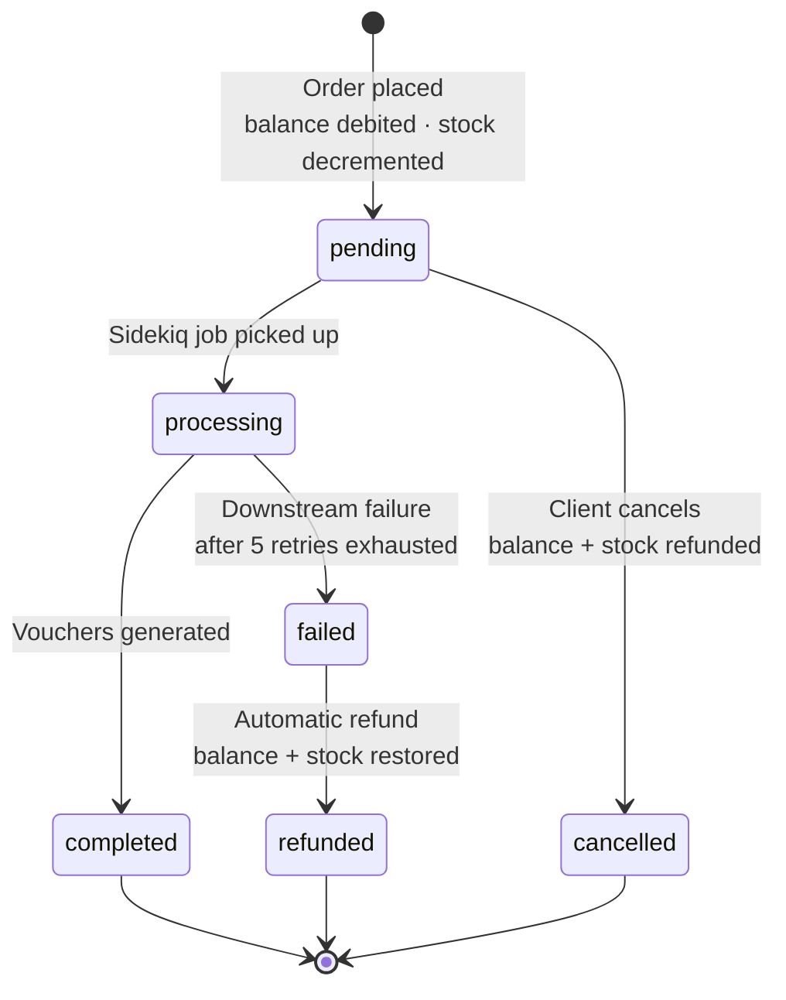
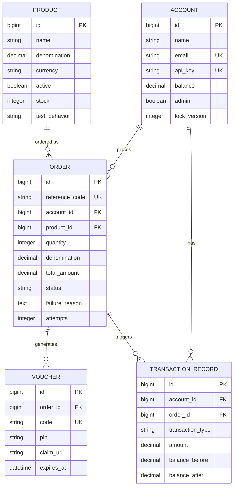
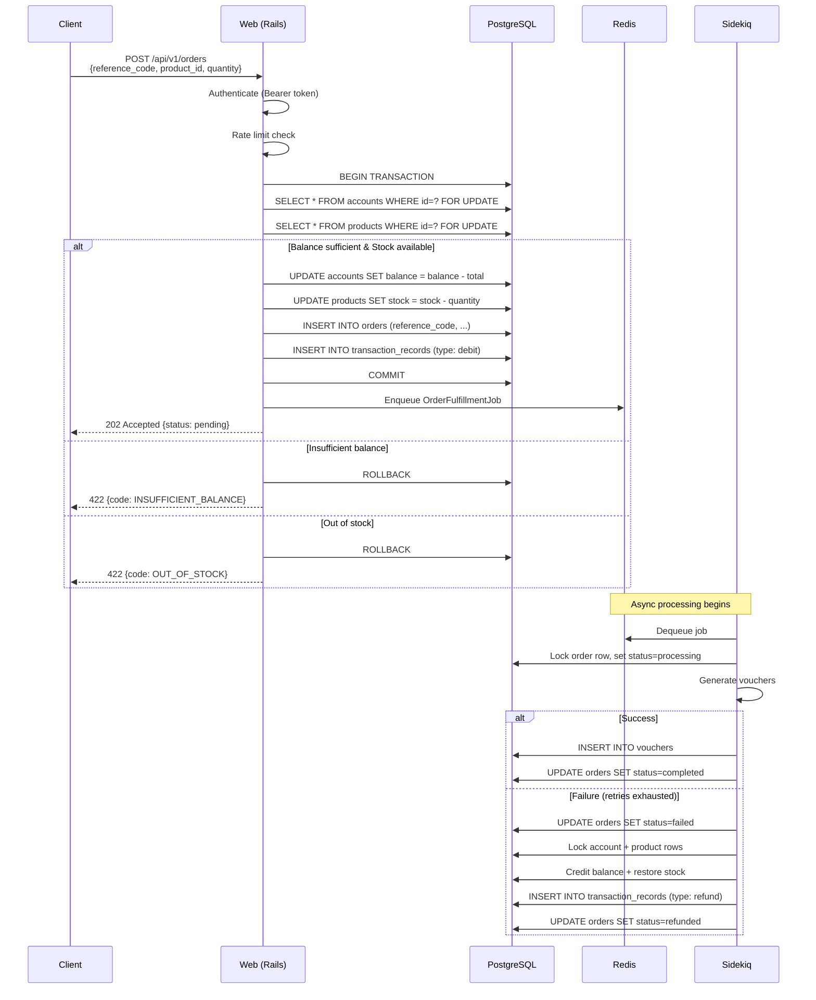
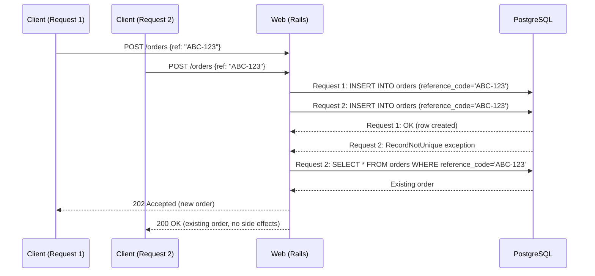

# System Architecture

## Network Topology

### Service Details

| Container | Image | Internal Port | Exposed | Role |
|---|---|---|---|---|
| `voucher-vendor-web-1` | ruby:3.3-slim | 3000 | **3000 → host** | Rails API + Puma |
| `voucher-vendor-db-1` | postgres:16-alpine | 5432 | 5433 → host | Primary database |
| `voucher-vendor-redis-1` | redis:7-alpine | 6379 | Internal only | Job queue + cache |
| `voucher-vendor-sidekiq-1` | ruby:3.3-slim | — | Internal only | Background worker |

### Communication

All services communicate via Docker's internal DNS — service names resolve to container IPs. Only the web service exposes port 3000 to the host. The database is optionally accessible on host port 5433 for debugging.

---

## Order State Machine

| Status | Description | Terminal? |
|---|---|:---:|
| `pending` | Order accepted, balance debited, queued for async processing | No |
| `processing` | Background job picked it up, working on fulfillment | No |
| `completed` | Voucher(s) generated successfully | Yes |
| `failed` | All retries exhausted, awaiting refund | No |
| `refunded` | Balance credited back + stock restored after failure | Yes |
| `cancelled` | Client cancelled before processing began, fully refunded | Yes |

---

## Entity Relationship Diagram

---

## Request Flow: Order Placement

---

## Request Flow: Idempotent Duplicate

