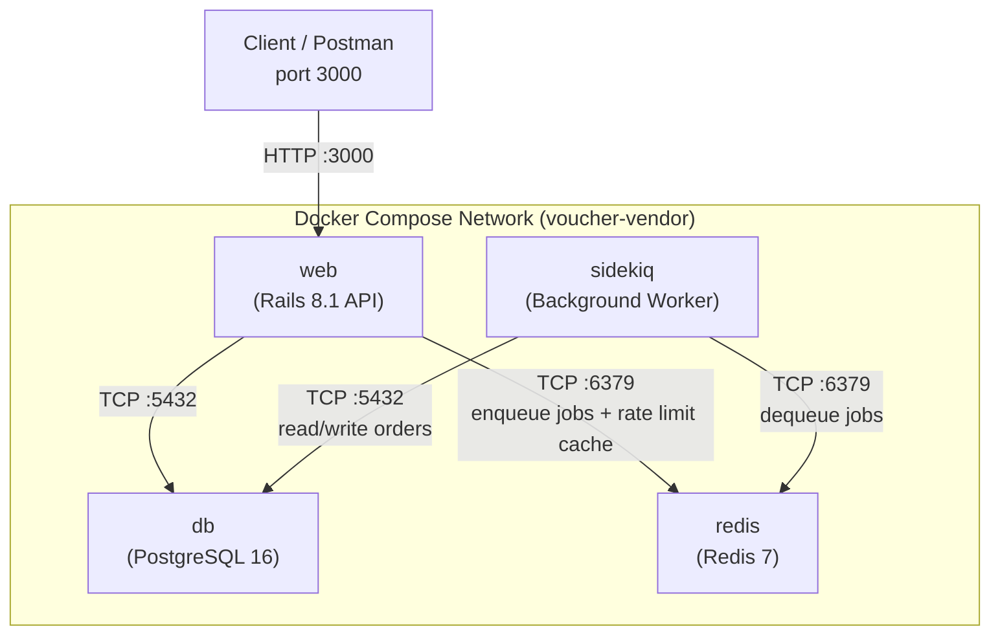
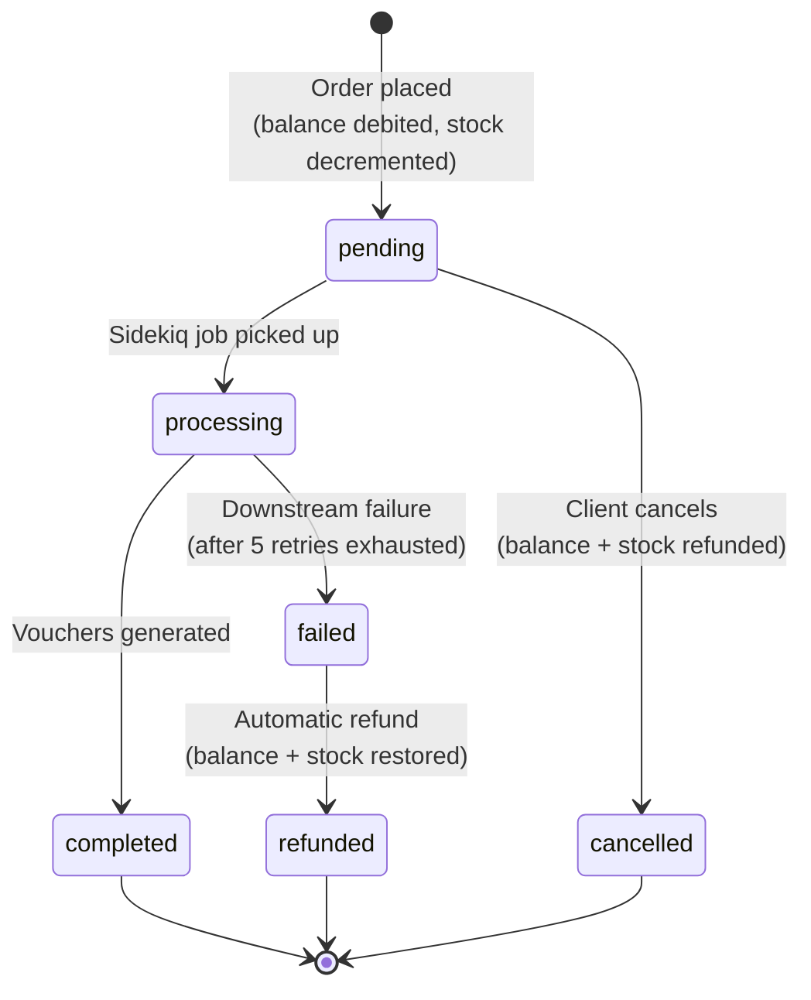
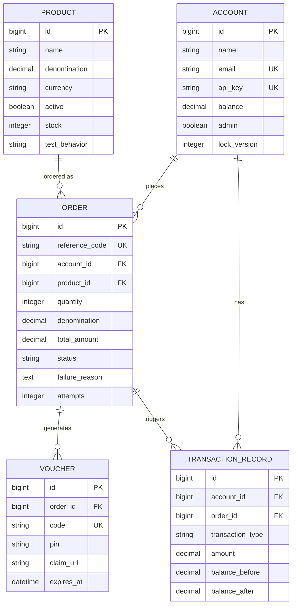
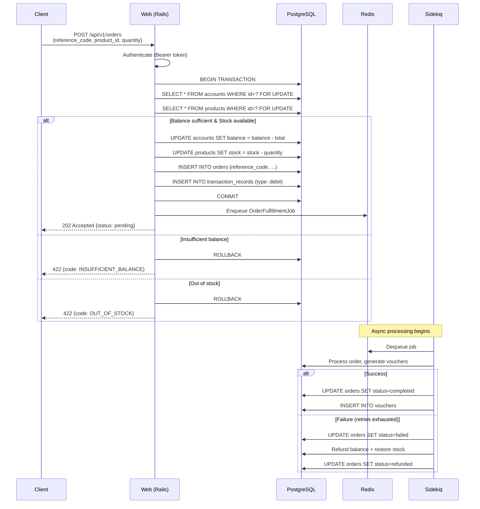
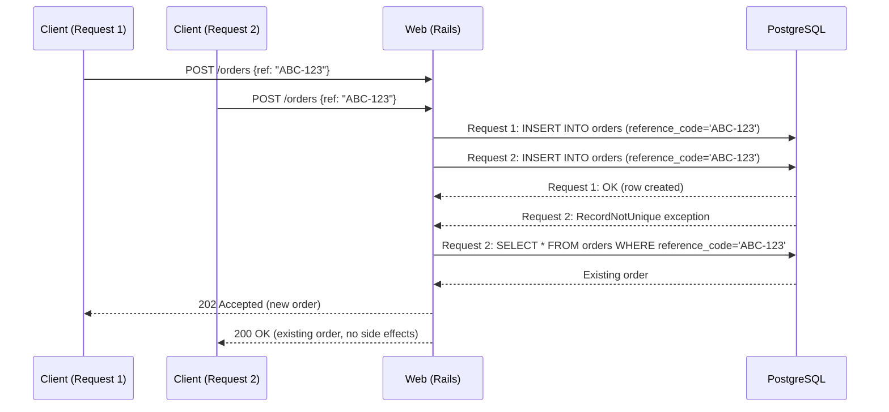

# System Architecture

## Network Topology

| Service | Container Name | Role | Exposed |
|---------|---------------|------|---------|
| **web** | `voucher-vendor-web-1` | Rails API server | Port 3000 to host |
| **db** | `voucher-vendor-db-1` | PostgreSQL 16 with row locks | Internal only |
| **redis** | `voucher-vendor-redis-1` | Job queue + rate limit cache | Internal only |
| **sidekiq** | `voucher-vendor-sidekiq-1` | Async job processor | Internal only |

All services communicate via Docker's internal DNS using service names as hostnames.

---

## Order State Machine

| Status | Description | Terminal? |
|--------|-------------|:---------:|
| `pending` | Order accepted, balance debited, queued for async processing | No |
| `processing` | Background job picked it up, working on fulfillment | No |
| `completed` | Voucher(s) generated successfully | Yes |
| `failed` | All retries exhausted, awaiting refund | No |
| `refunded` | Balance credited back + stock restored after failure | Yes |
| `cancelled` | Client cancelled before processing began, fully refunded | Yes |

---

## Entity Relationship Diagram

---

## Request Flow: Order Placement

---

## Request Flow: Idempotent Duplicate

