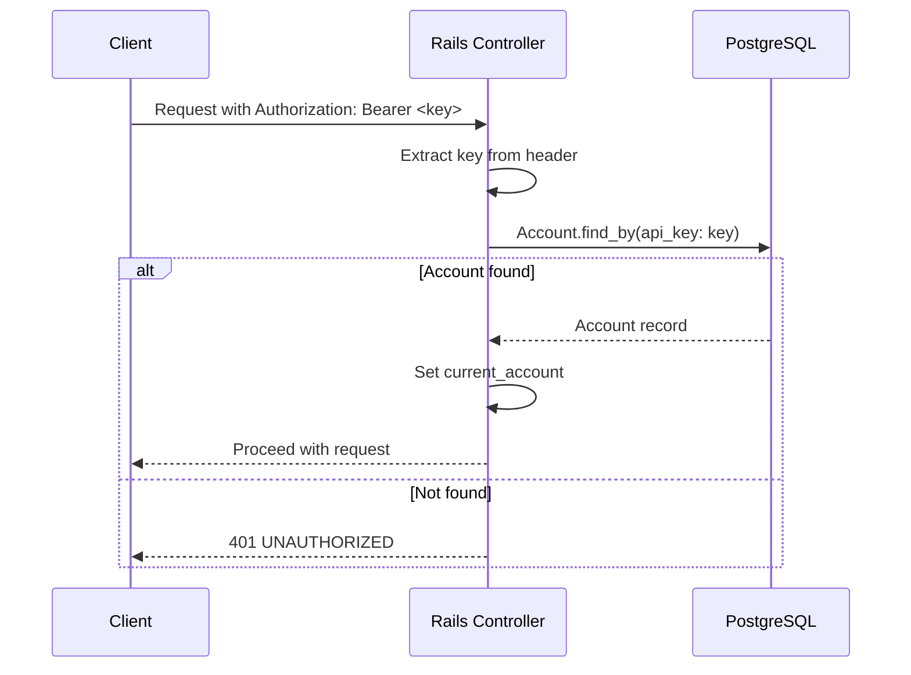

# Authentication & Authorization

## API Key Authentication

Every request (except account creation) requires a Bearer token in the `Authorization` header:

```
Authorization: Bearer <api_key>
```

### How API Keys Are Generated

Keys are deterministic, generated using HMAC-SHA256:

```ruby
OpenSSL::HMAC.hexdigest("SHA256", server_secret, email)
```

| Property | Detail |
|----------|--------|
| **Algorithm** | HMAC-SHA256 |
| **Input** | `API_KEY_SECRET` env var + account email |
| **Deterministic** | Same email + same secret = same key (regenerable) |
| **Shown once** | Only returned in the `POST /api/v1/accounts` response |

### Authentication Flow



### Key Rotation

Changing the `API_KEY_SECRET` environment variable invalidates all existing keys. This acts as a global key rotation mechanism.

---

## Admin Authorization

Certain endpoints are restricted to admin accounts:

| Endpoint | Why Admin-Only |
|----------|---------------|
| `POST /api/v1/accounts/top_up` | Adding funds is a privileged financial operation |
| `POST /api/v1/products/:id/replenish` | Stock management is an internal operation |

### How It Works

The `accounts` table has an `admin` boolean column (default: `false`). Protected controllers use:

```ruby
before_action :require_admin!, only: [:top_up]
```

Non-admin accounts receive:

```json
{
  "status": "ERROR",
  "error": {
    "code": "FORBIDDEN",
    "message": "Admin access required"
  }
}
```

### Seed Data

The database seeds create a pre-configured admin account:

```bash
docker compose exec web bin/rails db:seed
# Output includes: Admin API key: <key>
```

---

## Rate Limiting

Per-account rate limiting protects the API from abuse.

| Setting | Value |
|---------|-------|
| **Limit** | 60 requests per minute |
| **Scope** | Per `Authorization` header (falls back to IP) |
| **Implementation** | Rails 8 built-in `rate_limit` |
| **Backing store** | Redis (via `redis_cache_store`) |
| **Test safety** | Test env uses `:null_store` — rate limits auto-disabled |

### Configuration

```ruby
# app/controllers/application_controller.rb
rate_limit to: ENV.fetch("RATE_LIMIT_RPM", 60).to_i,
           within: 1.minute,
           by: -> { request.headers["Authorization"] || request.remote_ip },
           with: -> { render_error("RATE_LIMITED", "Rate limit exceeded. Try again shortly.", :too_many_requests) }
```

### Reviewer Note

The default of **60 RPM** is intentionally generous for manual testing. You won't hit the limit during normal API exploration. The test suite is also unaffected since the test environment disables rate limiting entirely via `config.cache_store = :null_store`.

### When Rate Limited (429)

```json
{
  "status": "ERROR",
  "error": {
    "code": "RATE_LIMITED",
    "message": "Rate limit exceeded. Try again shortly."
  }
}
```
