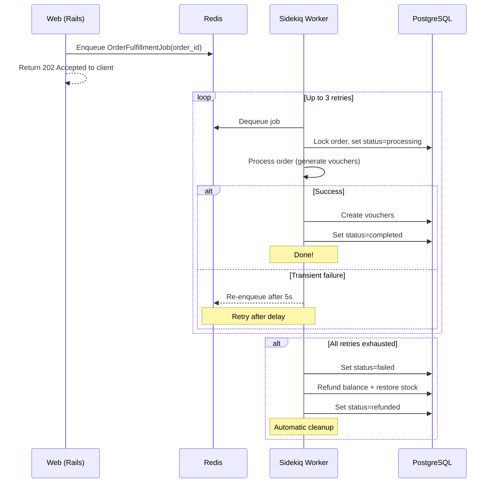

# Background Job Processing

## Why Async?

Order fulfillment involves downstream processing (generating vouchers, potentially calling external APIs). Running this synchronously would:

- Block the HTTP response until processing completes
- Make the API vulnerable to downstream timeouts
- Prevent retry logic on transient failures

Instead, the API returns `202 Accepted` immediately and processes the order asynchronously via Sidekiq.

## Job Architecture



## Retry Strategy

| Setting | Value |
|---------|-------|
| **Max retries** | 3 |
| **Backoff** | Fixed 5 seconds |
| **Total window** | ~15 seconds |

```ruby
class OrderFulfillmentJob < ApplicationJob
  sidekiq_options retry: 3
  sidekiq_retry_in { |_count, _exception| 5 }
end
```

## Automatic Refund on Exhaustion

When all 3 retries are exhausted, the `sidekiq_retries_exhausted` callback triggers:

```ruby
sidekiq_retries_exhausted do |msg, _exception|
  args = msg["args"].first
  order_id = args.is_a?(Hash) ? args["arguments"].first : args
  order = Order.find(order_id)

  order.update!(status: Order::FAILED, failure_reason: msg["error_message"])
  Orders::RefundService.call(order)
  order.update!(status: Order::REFUNDED)
end
```

Note: ActiveJob wraps Sidekiq args — `msg["args"].first` is a Hash containing `"arguments"`, not the raw job arguments.

The `RefundService`:
1. Locks the account row → credits balance back
2. Locks the product row → restores stock
3. Creates a `REFUND` transaction record for audit
4. Order status transitions: `failed` → `refunded`

**No manual intervention needed.** Failed orders are automatically cleaned up.

## Idempotent Processing

The fulfillment job is safe to retry:

- If the order is already `completed`, `cancelled`, or `refunded` — the job skips processing
- The status check happens **after** acquiring a row lock, preventing race conditions with cancel requests

## Test Products

Products with `test_behavior` allow deterministic testing of all job outcomes. Test product simulation is handled by `Orders::TestProductSimulator`, completely separate from the real fulfillment pipeline.

| Product | `test_behavior` | Job Outcome |
|---------|:---------------:|-------------|
| Amazon Gift Card | `null` | Normal processing (~80% success in dev) |
| Test - Always Succeeds | `success` | Completes immediately |
| Test - Always Fails | `failure` | Fails → retries → refund via exhaustion handler |
| Test - Succeeds After Retries | `pending` | 3 transient failures → completes on attempt 4 |
| Test - Fails After Retry | `refund` | 3 transient failures → refunded on attempt 4 |

This lets reviewers observe every state transition without relying on randomness.

## Monitoring

The Sidekiq Web UI is mounted at `/sidekiq`:

```
http://localhost:3000/sidekiq
```

From here you can monitor:
- **Queues** — pending jobs
- **Retries** — jobs waiting for retry
- **Dead** — jobs that exhausted all retries
- **Busy** — currently processing workers
