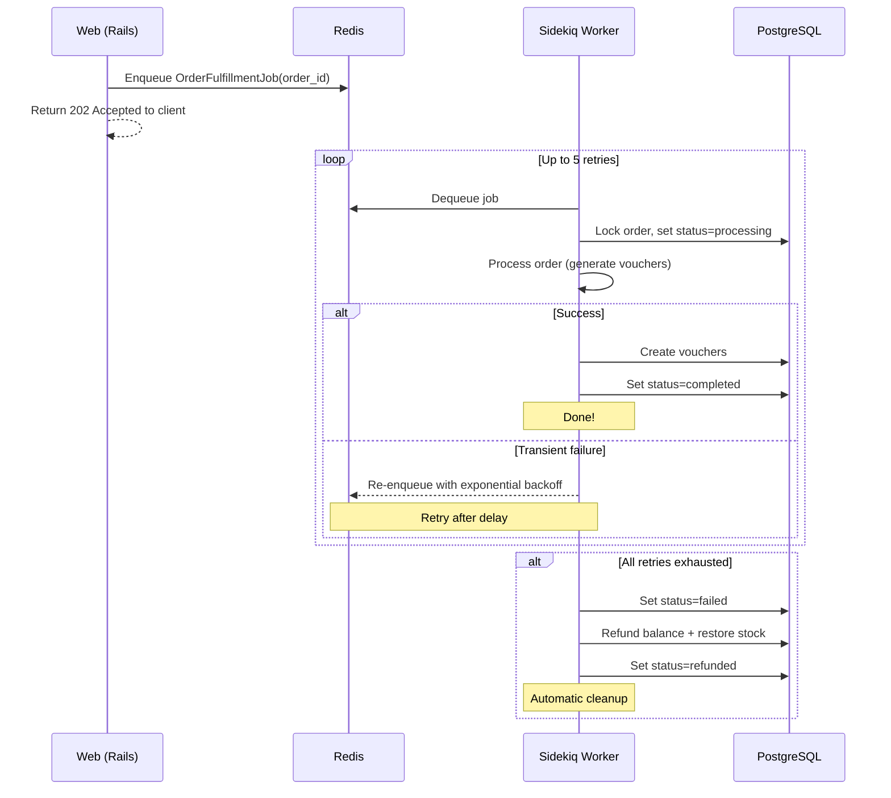

# Background Job Processing

## Why Async?

Order fulfillment involves downstream processing (generating vouchers, potentially calling external APIs). Running this synchronously would:

- Block the HTTP response until processing completes
- Make the API vulnerable to downstream timeouts
- Prevent retry logic on transient failures

Instead, the API returns `202 Accepted` immediately and processes the order asynchronously via Sidekiq.

## Job Architecture



## Retry Strategy

| Setting | Value |
|---------|-------|
| **Max retries** | 5 |
| **Backoff** | Exponential (Sidekiq default) |
| **Retry delays** | ~25s, ~46s, ~75s, ~113s, ~160s |
| **Total window** | ~7 minutes |

```ruby
class OrderFulfillmentJob
  include Sidekiq::Job
  sidekiq_options retry: 5
end
```

## Automatic Refund on Exhaustion

When all 5 retries are exhausted, the `sidekiq_retries_exhausted` callback triggers:

```ruby
sidekiq_retries_exhausted do |job, exception|
  order = Order.find(job["args"].first)
  order.update!(status: Order::FAILED, failure_reason: exception.message)
  Orders::RefundService.call(order)
end
```

The `RefundService`:
1. Locks the account row → credits balance back
2. Locks the product row → restores stock
3. Creates a `REFUND` transaction record for audit
4. Order status transitions: `failed` → `refunded`

**No manual intervention needed.** Failed orders are automatically cleaned up.

## Idempotent Processing

The fulfillment job is safe to retry:

- If the order is already `completed`, `cancelled`, or `refunded` — the job skips processing
- The status check happens **after** acquiring a row lock, preventing race conditions with cancel requests

## Test Products

Products with `test_behavior` allow deterministic testing of all job outcomes:

| Product | `test_behavior` | Job Outcome |
|---------|:---------------:|-------------|
| Amazon Gift Card | `null` | Normal processing (~80% success in dev) |
| Test - Always Succeeds | `success` | Completes immediately |
| Test - Always Fails | `failure` | Fails → retries → refund |
| Test - Stays Pending | `pending` | Stays in `processing` indefinitely |
| Test - Fails After Retry | `refund` | Fails after processing → refund |

This lets reviewers observe every state transition without relying on randomness.

## Monitoring

The Sidekiq Web UI is mounted at `/sidekiq`:

```
http://localhost:3000/sidekiq
```

From here you can monitor:
- **Queues** — pending jobs
- **Retries** — jobs waiting for retry
- **Dead** — jobs that exhausted all retries
- **Busy** — currently processing workers
