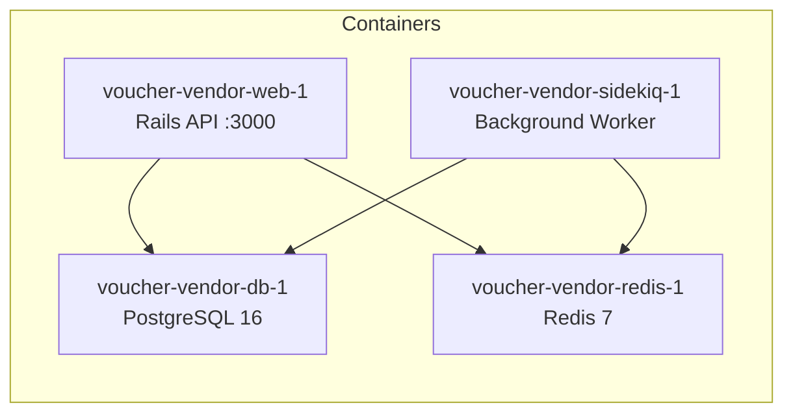

# Docker Setup

## Quick Start

```bash
# Start all 4 services
docker compose up --build

# Setup database (separate terminal)
docker compose exec web bin/rails db:create db:migrate db:seed

# Verify
curl http://localhost:3000/up
```

## Services



| Container | Image | Purpose | Ports |
|-----------|-------|---------|-------|
| `voucher-vendor-web-1` | Custom (ruby:3.3-slim) | Rails API server | **3000:3000** |
| `voucher-vendor-db-1` | postgres:16-alpine | Primary database | 5433:5432 |
| `voucher-vendor-redis-1` | redis:7-alpine | Job queue + cache | 6379 (internal) |
| `voucher-vendor-sidekiq-1` | Custom (ruby:3.3-slim) | Async job processor | None |

### Container Naming

Containers use human-friendly names via `COMPOSE_PROJECT_NAME=voucher-vendor` in the `.env` file. This prefixes all containers with `voucher-vendor-` instead of the directory name.

### Health Checks

Both `db` and `redis` have Docker health checks:

- **db:** `pg_isready` every 5 seconds
- **redis:** `redis-cli ping` every 5 seconds

The `web` and `sidekiq` services wait for both to be healthy before starting (via `depends_on` with `condition: service_healthy`).

## Environment Variables

| Variable | Service | Purpose | Default |
|----------|---------|---------|---------|
| `DB_HOST` | web, sidekiq | PostgreSQL hostname | `db` |
| `DB_USERNAME` | web, sidekiq | Database user | `postgres` |
| `DB_PASSWORD` | web, sidekiq | Database password | `password` |
| `REDIS_URL` | web, sidekiq | Redis connection string | `redis://redis:6379/0` |
| `API_KEY_SECRET` | web, sidekiq | HMAC key for API key generation | `dev_secret_key_change_in_production` |
| `RAILS_ENV` | web | Rails environment | `development` |
| `RATE_LIMIT_RPM` | web | Requests per minute limit | `60` |

### Secrets

For this assessment, secrets are defined directly in `docker-compose.yml` for reviewer convenience. In production, these would be injected via Docker secrets, a vault, or environment-specific configuration.

The `.env` file only contains `COMPOSE_PROJECT_NAME` — no secrets.

## Volumes

| Volume | Purpose |
|--------|---------|
| `postgres_data` | Persistent PostgreSQL data across container restarts |
| `bundle_cache` | Shared gem cache between web and sidekiq (faster rebuilds) |

## Common Commands

```bash
# View logs for a specific service
docker compose logs -f web
docker compose logs -f sidekiq

# Run migrations
docker compose exec web bin/rails db:migrate

# Open Rails console
docker compose exec web bin/rails console

# Run a single test file
docker compose exec -e RAILS_ENV=test web bundle exec rspec spec/services/orders/placement_service_spec.rb

# Rebuild after Gemfile changes
docker compose up --build

# Stop and remove everything (keeps data volumes)
docker compose down

# Full cleanup including data
docker compose down -v
```

## Dockerfile

The image is based on `ruby:3.3-slim` with minimal system dependencies:

```docker
FROM ruby:3.3-slim

RUN apt-get update -qq && \
    apt-get install --no-install-recommends -y \
    build-essential libpq-dev libyaml-dev git curl postgresql-client

WORKDIR /app
COPY Gemfile Gemfile.lock ./
RUN bundle install
COPY . .

EXPOSE 3000
CMD ["bin/rails", "server", "-b", "0.0.0.0"]
```

The `sidekiq` service uses the same image with a different command: `bundle exec sidekiq`.
