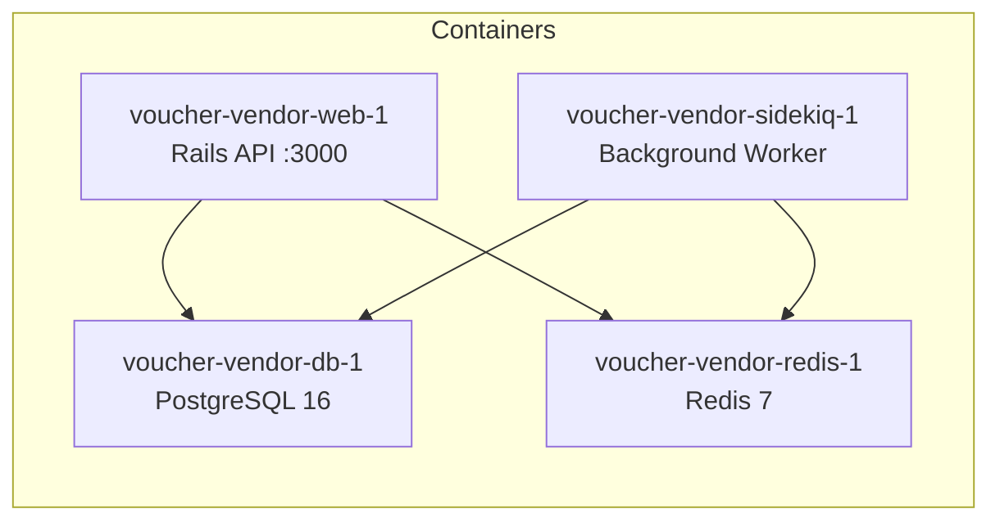

# Docker Setup

## Quick Start

```bash
git clone https://github.com/code-it-samurai/Voucher-Vendor-API-Rails.git
cd Voucher-Vendor-API-Rails
docker compose up --build
```

The entrypoint script automatically handles database creation, migrations, and seeding. No manual setup needed.

| URL | What |
|---|---|
| `http://localhost:3000` | API |
| `http://localhost:3000/sidekiq` | Sidekiq dashboard |

## What Happens on Startup

The `bin/docker-entrypoint` script runs before the Rails server starts:

1. Removes stale PID files from previous containers
2. Runs `db:prepare` — creates database if missing, runs pending migrations
3. Runs `db:seed` — seeds test products and admin account
4. Starts the Puma web server

Sidekiq skips the entrypoint and starts directly.

## Services



| Container | Image | Purpose | Ports |
|---|---|---|---|
| `voucher-vendor-web-1` | ruby:3.3-slim | Rails API server | **3000 → host** |
| `voucher-vendor-db-1` | postgres:16-alpine | Primary database | 5433 → host |
| `voucher-vendor-redis-1` | redis:7-alpine | Job queue + cache | Internal only |
| `voucher-vendor-sidekiq-1` | ruby:3.3-slim | Async job processor | Internal only |

### Container Naming

Containers use human-friendly names via `COMPOSE_PROJECT_NAME=voucher-vendor` in the `.env` file.

### Health Checks

Both `db` and `redis` have Docker health checks. The `web` and `sidekiq` services wait for both to be healthy before starting (`depends_on` with `condition: service_healthy`).

## Environment Variables

| Variable | Service | Purpose | Default |
|---|---|---|---|
| `DB_HOST` | web, sidekiq | PostgreSQL hostname | `db` |
| `DB_USERNAME` | web, sidekiq | Database user | `postgres` |
| `DB_PASSWORD` | web, sidekiq | Database password | `password` |
| `REDIS_URL` | web, sidekiq | Redis connection | `redis://redis:6379/0` |
| `API_KEY_SECRET` | web, sidekiq | HMAC key for API keys | `dev_secret_key_change_in_production` |
| `RAILS_ENV` | web | Rails environment | `development` |
| `RATE_LIMIT_RPM` | web | Requests per minute | `60` |

### Secrets

For this assessment, secrets are defined directly in `docker-compose.yml` for reviewer convenience. In production, these would be injected via Docker secrets or a vault. The `.env` file only contains `COMPOSE_PROJECT_NAME`.

## Volumes

| Volume | Purpose |
|---|---|
| `postgres_data` | Persistent PostgreSQL data across restarts |
| `bundle_cache` | Shared gem cache between web and sidekiq |

## Common Commands

```bash
# View logs
docker compose logs -f web
docker compose logs -f sidekiq

# Run migrations
docker compose exec web bin/rails db:migrate

# Rails console
docker compose exec web bin/rails console

# Run a single test file
docker compose exec -e RAILS_ENV=test web bundle exec rspec spec/services/orders/placement_service_spec.rb

# Rebuild after Gemfile changes
docker compose up --build

# Stop (keeps data)
docker compose down

# Full cleanup including data
docker compose down -v
```
